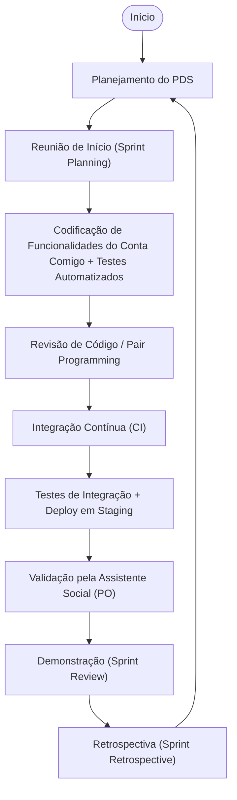

# Atv: Especificação de um processo simplificado para uso no PDS Distribuido – Projeto Conta Comigo: SAFE
*(PDS Distribuído – 4º Período, TADS – IFRN Natal Central)*

O **Conta Comigo: SAFE** é um sistema que conecta alunos a uma Assistente Social do IFRN para tirar dúvidas, receber orientações e facilitar o acompanhamento de situações específicas.  
O sistema permite que os alunos enviem perguntas, a Assistente Social responda e o histórico de interações seja registrado de forma organizada.

---

## 1. Diagrama de Atividades – Ciclo de Vida

---

## 2. O que acontece em cada etapa

- **Planejamento do PDS**  
  TOda a equipe define o escopo da sprint baseado nas funcionalidades do **Conta Comigo**, como envio de perguntas, listagem, autenticação e painel da Assistente Social.  
  É levado em conta o cronograma oficial do PDS Distribuído.

- **Reunião de Início (Sprint Planning)**  
  O time detalha as histórias de usuário, como *"Aluno envia pergunta"*, *"Assistente Social responde"*, *"Listar dúvidas pendentes"*, quebrando em tarefas menores e atribuindo responsáveis.

- **Codificação + Testes Automatizados**  
  As funcionalidades são desenvolvidas com **TDD** (Test-Driven Development), criando testes unitários para garantir que cada parte funcione antes de ir para a próxima etaps.

- **Revisão de Código / Pair Programming**  
  Dois devs revisam juntos para manter a qualidade e evitar que erros cheguem à produção.

- **Integração Contínua (CI)**  
  Cada commit no repositório dispara testes automáticos, garantindo que as funcionalidades como cadastro, login, fluxo de perguntas e etc, não sejam quebradas por alterações.

- **Testes de Integração + Deploy em Staging**  
  O sistema é implantado em um ambiente de testes, onde simulamos situações reais, como envio de perguntas por diferentes alunos e validação das respostas pela Assistente Social(AS).

- **Validação pela Assistente Social (PO)**  
  A Assistente Social (AS) verifica se as funcionalidades atendem às necessidades dela no dia a dia, como receber notificações de novas perguntas.

- **Demonstração (Sprint Review)**  
  O time apresenta as novas funcionalidades, como filtros de perguntas ou melhorias na interface, e coleta feedback imediato.

- **Retrospectiva (Sprint Retrospective)**  
  O time avalia o que funcionou bem e o que pode ser melhorado para a próxima sprint.

---

## 3. Papéis e responsabilidades

| Papel                         | O que faz                                                                 |
|-------------------------------|----------------------------------------------------------------------------|
| **Desenvolvedor**             | Implementa funcionalidades do Conta Comigo, cria testes e integra código  |
| **Assistente Social (PO)**    | Define prioridades e valida entregas do sistema                            |
| **Scrum Master / Facilitador**| Garante que o processo está sendo seguido e remove impedimentos            |
| **QA (membro do time)**       | Cria e executa testes, registra bugs                                       |
| **Professor / Orientador**    | Dá suporte técnico e garante aderência ao PDS                              |

---

## 4. Práticas ágeis aplicadas

- Backlog no GitHub Projects com histórias de usuário reais do Conta Comigo
- Sprint Planning para priorizar funcionalidades que trazem valor imediato
- TDD e testes automatizados desde o início
- Pair Programming e Code Review para garantir qualidade
- Integração Contínua com GitHub Actions
- Deploy em ambiente de testes antes da produção
- Sprint Review com PO e professor
- Retrospectiva para ajustes no processo

---

## 5. Publicação no GitHub Pages
Link do repositório do projeto: [Conta Comigo: SAFE](https://github.com/tads-cnat/Conta-Comigo)
